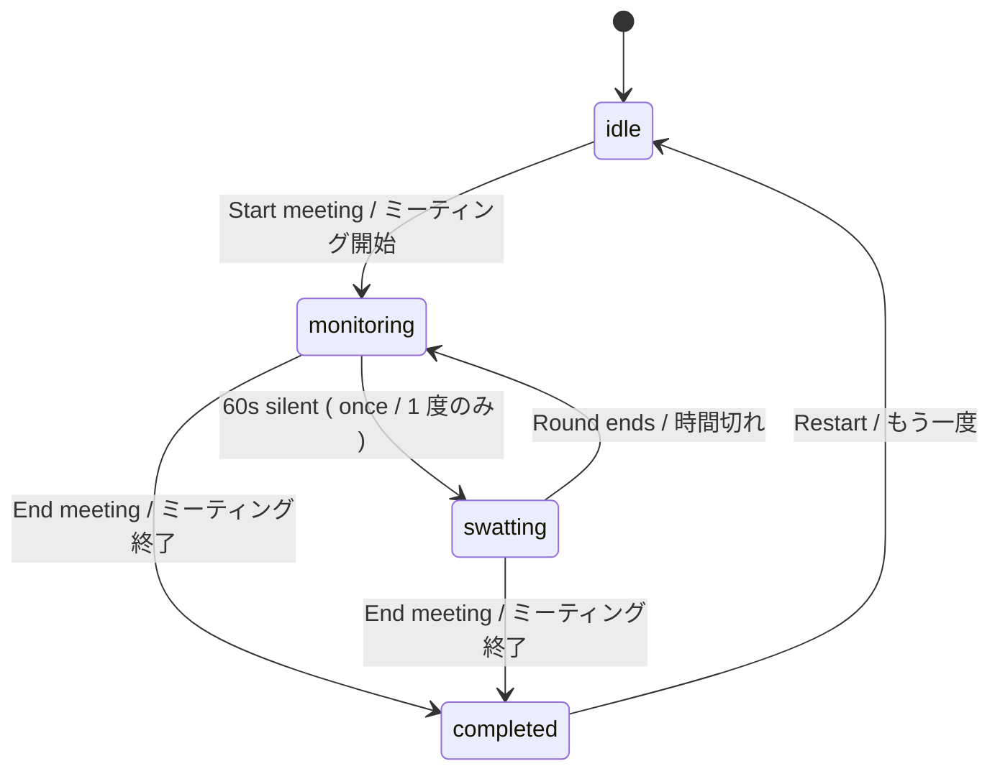

<div align="center">

# Boring Meeting Flyswatter

**Swat the boredom out of your next meeting.**
**退屈な会議に、ハエ叩きを 1 回。**

A browser-only experiment that quietly measures meeting silence, marks the first boredom point, and lets you swat it away — once per meeting. Open the demo, start a meeting, stay quiet for 60 seconds, and a 15-second fly-swatting mini-game pops up.

ブラウザだけで動く実験プロダクト。会議の沈黙を計測して「最初に退屈になった瞬間」を残し、その時点で 1 回だけ 15 秒のハエ叩きミニゲームが起動する。


[](https://github.com/susumutomita/boring-meeting-flyswatter/actions/workflows/ci.yml)
[](https://github.com/susumutomita/boring-meeting-flyswatter/actions/workflows/pages.yml)
[](./LICENSE)


[**Open the live demo / ライブデモ**](https://susumutomita.github.io/boring-meeting-flyswatter/)
&nbsp;·&nbsp;
[Concept](#concept--コンセプト)
&nbsp;·&nbsp;
[Features](#features--機能)
&nbsp;·&nbsp;
[How it works](#how-it-works--仕組み)
&nbsp;·&nbsp;
[Setup](#setup--セットアップ)

</div>

---

## Pitch / ピッチ

> **EN** — Most meetings have a moment when everyone quietly checks out. We don't capture it, so it doesn't get fixed. Boring Meeting Flyswatter is a browser tab that listens to the silence, freezes the first boredom point, and turns it into a 15-second swatting round you can actually finish — then asks one question: "why was it boring?". The answer is shared with the room over WebRTC, anonymized to a preset tag. No accounts, no recording, no install.
>
> **JA** — どの会議にも、全員がすっと興味を失う瞬間がある。それが残らないから改善されない。Boring Meeting Flyswatter はブラウザのタブ 1 つで沈黙を計測し、最初の退屈ポイントを記録、15 秒のハエ叩きミニゲームに変える。最後に「なぜ退屈だった？」をプリセットタグで聞き、ルーム内に WebRTC で共有する。アカウント不要・録音なし・インストールなし。

## Concept / コンセプト

> "The most painful problem in business is also the most unrecognized: meetings are bad."  
> — Patrick Lencioni, *Death by Meeting*

- Boredom is a signal — but nobody logs it.
- We log it once per meeting, the moment it first happens.
- Then we make the moment fun, not punishing.

- 退屈はシグナル。でも普段は記録されない。
- 1 ミーティング 1 回、最初に退屈した瞬間だけ記録する。
- 記録の瞬間を罰ではなく遊びにする。

## Features / 機能

| EN | JA |
| --- | --- |
| **Silence-aware boredom timer** — kicks once after 60s of silence and inactivity. Records `firstBoredomSecond` so the dataset stays clean. | **沈黙監視タイマー** — 沈黙と無操作が 60 秒続くと 1 度だけ起動。「最初に退屈した秒」を残す。 |
| **15-second swatting mini-game** — flies (+1), Frappuccino bonus (×2 score), golden bee (+10). No penalty paths during play. | **15 秒ハエ叩きミニゲーム** — ハエ +1、フラペチーノ ×2、黄金のハチ +10。プレイ中に減点は無し。 |
| **Tier-based recap** — Platinum 100+ / Gold 50+ / Bronze 15+ / Rookie. | **称号評価** — プラチナ 100+ / ゴールド 50+ / ブロンズ 15+ / 見習い。 |
| **Subjective productivity score** — 1–10 slider per peer; the average is shown to the whole room. | **主観評価** — 各人 1〜10 のスライダー、ルーム全員の平均を表示。 |
| **Why-bored picker** — preset tags only ( `議題が逸れた` / `一方通行` / etc. ); no free text, no PII. | **退屈の理由ピッカー** — プリセット選択のみ。自由入力なし、個人情報なし。 |
| **WebRTC room sharing** — peers share scores, reasons, productivity score over a PeerJS-brokered DTLS channel. | **ルーム共有** — PeerJS のブローカ経由 ( DTLS ) でスコア / 理由 / 主観評価を同期。 |
| **Document Picture-in-Picture** — the boredom meter detaches into a small always-on-top window ( Chromium ). | **Document Picture-in-Picture** — メーターを常駐の小窓に分離 ( Chromium 系 )。 |
| **Browser notification** — when the swatting round arms while you're on another tab. | **ブラウザ通知** — 別タブにいてもハエ叩きが起動するとお知らせ。 |
| **i18n** — JA / EN / ES / ZH switchable via the top-bar picker; choice is persisted. | **多言語対応** — JA / EN / ES / ZH をトップバーで切替、保存。 |

## How it works / 仕組み

### Phases / フェーズ遷移



### Inputs / 入力ソース

| Source | API | Scope |
| --- | --- | --- |
| Keyboard / pointer / focus | `window` listeners | Local user activity |
| Microphone | `getUserMedia({ audio: true })` → Web Audio Analyser → RMS | Local user's own voice |

The microphone is enabled automatically when the meeting starts. Tab audio capture was removed because it picks up *other* participants' voices and the boredom signal we want is the local user's silence.

マイクはミーティング開始で自動 ON。タブ音声検知は他参加者の声まで拾ってしまうため廃止。

### Stack / スタック

Bun · Vite · React 18 · TypeScript · Biome · `bun test` · PeerJS · Document Picture-in-Picture API · GitHub Pages.

## Setup / セットアップ

```bash
git clone https://github.com/susumutomita/boring-meeting-flyswatter
cd boring-meeting-flyswatter
bun install
bun run dev   # http://localhost:5173/
```

Requires Bun 1.x. Works in any modern Chromium-based browser ( Picture-in-Picture requires Chromium ).

Bun 1.x が必要。Document Picture-in-Picture は Chromium 系のみ。

## Development / 開発

| Command | Purpose |
| --- | --- |
| `make dev` | Dev server / 開発サーバ |
| `make lint` | Biome check |
| `make format` | Biome format |
| `make typecheck` | `tsc --noEmit` |
| `make test` | `bun test` ( BDD, JP titles ) |
| `make build` | Production build |
| `make before-commit` | textlint + lint + typecheck + test + build |

### Conventions / 規約

- Domain logic lives in `packages/frontend/src/lib/` as pure, TDD'd functions ( real I/O, no mocks ).
- Tests are BDD-style with Japanese titles ending in「〜であるべき」.
- Hook callbacks ( `onSpeech`, `onError`, etc. ) are passed through `useRef` to avoid re-registering listeners.
- Full project guidance lives in [CLAUDE.md](./CLAUDE.md).

## Known limits / 既知の制約

| Area | Note |
| --- | --- |
| Document Picture-in-Picture | Chromium-only ( Chrome / Edge / Arc ). Safari / Firefox fall back to in-tab display. |
| Desktop meeting apps | Zoom / Teams / Meet desktop clients require OS-level system-audio sharing — out of scope. Use the browser version. |
| Room codes | PeerJS public broker ( `0.peerjs.com` ). DTLS encrypts traffic, but the broker sees connection metadata. |

## Roadmap / ロードマップ

- [ ] Self-hosted Hono signaling server for true LAN-only mode.
- [ ] Camera-presence detection ( frame diff / FaceDetector API ).
- [ ] Local meeting history with boredom-trend rollups.
- [ ] Translate the recap screen and the meeting tips ( currently the recap stays JA ).

## Contributing / コントリビュート

Issues for bugs and ideas welcome. PRs should pass `make before-commit` and follow Conventional Commits. Add a spec note under `docs/specs/` before non-trivial implementation.

## License / ライセンス

[MIT](./LICENSE)
