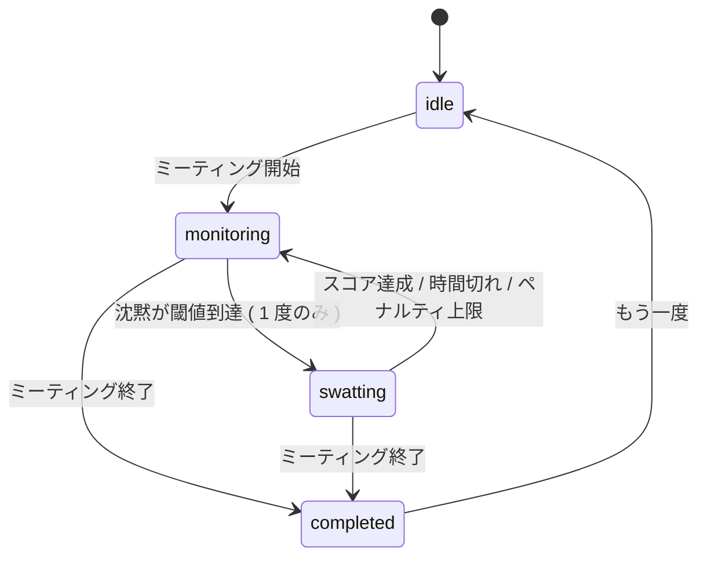

<div align="center">

# Boring Meeting Flyswatter

**退屈な会議に、ハエ叩きを 1 回。**

ブラウザだけで会議の沈黙を観測し、最初の退屈ポイントを記録、合間にハエ叩きで 1 度だけ介入する実験プロダクト。

[](https://github.com/susumutomita/boring-meeting-flyswatter/actions/workflows/ci.yml)
[](https://github.com/susumutomita/boring-meeting-flyswatter/actions/workflows/pages.yml)
[](./LICENSE)


[**ライブデモを開く**](https://susumutomita.github.io/boring-meeting-flyswatter/)
&nbsp;·&nbsp;
[コンセプト](#コンセプト)
&nbsp;·&nbsp;
[機能](#機能)
&nbsp;·&nbsp;
[アーキテクチャ](#アーキテクチャ)
&nbsp;·&nbsp;
[セットアップ](#セットアップ)
&nbsp;·&nbsp;
[開発](#開発)

</div>

---

## コンセプト

会議が「退屈になった瞬間」を、誰かの主観ではなくブラウザの計測で残したい。残すだけだと退屈なので、その瞬間にハエ叩きを 1 回だけ走らせて、参加者にちょっとした介入の余白を残す。

> 「ビジネス会議で最大の問題は、それがしばしば退屈である、ということだ。」
> — パトリック・レンシオーニ

## 機能

| 機能 | できること |
| --- | --- |
| **退屈度メーター** | 沈黙が続くたびに静かに伸びる。発話とキー操作で素早くリセット。 |
| **ハエ叩き介入 ( 1 ミーティング 1 回 )** | 退屈閾値に達した瞬間、初回の時刻を記録してハエ叩きが起動。連続発火しないので「最初に退屈になった時間」のデータを汚さない。 |
| **フラペチーノ ボーナス** | 開始 3 秒後に 1 個だけ漂う。叩くと 5 秒間の ` ×2 ` 倍率。何匹かのハエを溜めてから狙うと美味しい。 |
| **タブ音声 / マイクで沈黙検知** | ` getDisplayMedia ` で会議タブの音声、または ` getUserMedia ` で自分のマイクを RMS 解析。発話を活動として扱う。 |
| **Document Picture-in-Picture** | 退屈メーターを ipmsg 風の小窓に切り出して常駐。会議画面に被らずに見える ( Chromium 系 ) 。 |
| **ルームコードでスコア共有** | 同じルームに合流すると、参加者のスコア・ベスト・退屈の理由を WebRTC で同期。会議全体の不満ランキングも見える。 |
| **退屈の理由は選択肢のみ** | 自由入力なし。漏れても会議特定情報にならない設計。 |
| **振り返りパネル** | 終了時に初回退屈時刻 / 合計沈黙 / 退屈率 / ハエ叩き結果 / 全員の理由集計 / 経営者の名言を 1 枚で表示。 |

## アーキテクチャ

### フェーズ遷移



### 退屈の入力ソース

| ソース | 取得 API | 範囲 | 備考 |
| --- | --- | --- | --- |
| キーボード / ポインター / フォーカス | ` window ` listener | 自分の操作 | デフォルトでオン |
| タブ音声 | ` getDisplayMedia({ audio: true }) ` | 共有したタブの音 ( 会議全員 ) | 「タブの音声も共有」を ON |
| マイク | ` getUserMedia({ audio: true }) ` | 自分の発話 | タブ共有が刺さらない環境のフォールバック |

### モジュール構成

```
packages/frontend/
├─ src/
│  ├─ App.tsx                       # オーケストレーション
│  ├─ components/
│  │  ├─ SwatterArena.tsx           # 盤面・ハエ・フラペチーノ・スワッター
│  │  ├─ MeetingHud.tsx             # サイドバーの枠 ( 子をスタック )
│  │  ├─ MeetingSummary.tsx         # 振り返り + 名言
│  │  ├─ ReasonPicker.tsx           # 退屈の理由タグ ( プリセットのみ )
│  │  ├─ ReasonAggregate.tsx        # ルーム全体の不満ランキング
│  │  ├─ RoomConnect.tsx            # ルームコード入力
│  │  ├─ ScoreLeaderboard.tsx       # ピアごとのカード
│  │  └─ PipMeter.tsx               # PiP の小窓内表示
│  ├─ hooks/
│  │  ├─ useMeetingTick.ts          # 1s + 90ms の二重タイマー
│  │  ├─ useActivityTracking.ts     # キー / ポインター / フォーカス
│  │  ├─ useStreamSpeechDetector.ts # MediaStream → 解析の共通パイプ
│  │  ├─ useTabAudioActivity.ts     # getDisplayMedia ラッパ
│  │  ├─ useMicrophoneActivity.ts   # getUserMedia ラッパ
│  │  ├─ useDocumentPip.ts          # Document Picture-in-Picture
│  │  ├─ useScoreShare.ts           # PeerJS ホスト / クライアント切替
│  │  └─ useSwatter.ts              # スワッター姿勢と命中効果
│  └─ lib/                          # 純粋関数 + テスト
│     ├─ meeting.ts                 # 会議状態 / フェーズ / 退屈ロジック
│     ├─ audio.ts                   # 発話判定 ( RMS / sustain )
│     ├─ scoreShare.ts              # ルームコード / ランキング / 集計
│     └─ quotes.ts                  # 名言と決定論的選択
```

## セットアップ

```bash
git clone https://github.com/susumutomita/boring-meeting-flyswatter
cd boring-meeting-flyswatter
bun install
bun run dev   # http://localhost:5173/
```

> Bun 1.x が必要。Windows でも Chromium 系ブラウザがあれば同等に動作する。

## 開発

| コマンド | やること |
| --- | --- |
| ` make dev ` | 開発サーバ |
| ` make lint ` | Biome チェック |
| ` make format ` | Biome フォーマット |
| ` make typecheck ` | ` tsc --noEmit ` |
| ` make test ` | ` bun test ` ( BDD / 日本語タイトル ) |
| ` make build ` | プロダクションビルド |
| ` make before-commit ` | textlint + lint + typecheck + test + build を一括 |

### コーディング規約

- ドメインロジックは ` lib/ ` 配下の純粋関数として TDD で書く ( 実 API / DB / IO を使い、モック禁止 ) 。
- テストは BDD スタイル + 日本語タイトル。 ` describe ` / ` it ` の本文を「〜であるべき」で締める。
- フックの ` onSpeech ` などコールバックは ` useRef ` 経由で渡し、リスナー再登録を避ける。
- 詳細は [CLAUDE.md](./CLAUDE.md) を参照。

## 既知の制約

| 領域 | 内容 |
| --- | --- |
| **Document Picture-in-Picture** | Chromium 系のみ ( Chrome / Edge / Arc ) 。Safari / Firefox はタブ内表示にフォールバック。 |
| **デスクトップ会議アプリ** | Zoom / Teams / Meet のデスクトップ版は OS のシステム音声共有が必要なため対象外。ブラウザ版を共有してもらう前提。 |
| **ルームコード** | PeerJS の公開ブローカ ( ` 0.peerjs.com ` ) を使用。コードを推測されると同じルームに第三者が参加できる。WebRTC ( DTLS ) で通信は暗号化されているが、ブローカには到達ログが残る。 |
| **完全 LAN モード** | ` packages/backend ` に Hono の自前シグナリングを置くオプションを検討中 ( 別 PR ) 。 |

## ロードマップ

- [ ] 自前 Hono シグナリングサーバ ( 同 LAN のみ接続できる真の LAN モード )
- [ ] カメラ在席検知 ( フレーム差分 / FaceDetector )
- [ ] ミーティング履歴 ( ローカル保存 ) と退屈傾向の集計
- [ ] 招待 URL 短縮 / QR

## コントリビュート

バグ・改善案は Issue へ。PR は ` make before-commit ` を Green にした上で Conventional Commits に近い書き方で。仕様書は ` docs/specs/ ` に追記してから実装すると流れがスムーズ。

## ライセンス

[MIT](./LICENSE)
