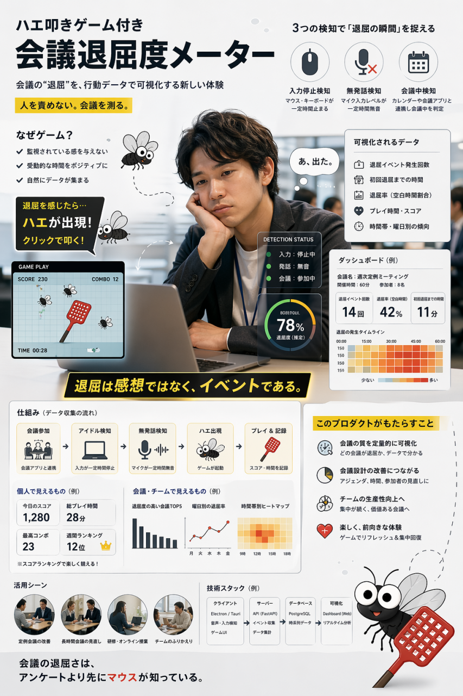
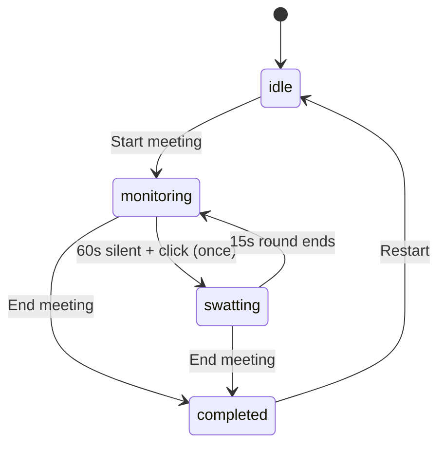

<div align="center">

# Boring Meeting Flyswatter

**Swat the boredom out of your next meeting.**

A browser-only experiment that watches a meeting for the first 60-second silence and turns it into a 15-second fly-swatting break.



[Live demo](https://susumutomita.github.io/boring-meeting-flyswatter/) · [Features](#features) · [Quick start](#quick-start) · [日本語](#日本語)

[](https://github.com/susumutomita/boring-meeting-flyswatter/actions/workflows/ci.yml)
[](https://github.com/susumutomita/boring-meeting-flyswatter/actions/workflows/pages.yml)
[](./LICENSE)

</div>

## Why

Most meetings have a moment when everyone quietly checks out. Nobody logs it, so nothing changes. This project logs that moment, *once* per meeting, and turns it into a 15-second mini-game so the act of recording is something you actually want to do.

<details>
<summary>Pitch deck (hackathon overview)</summary>


</details>

## Features

- **Silence-aware boredom timer.** Triggers once per meeting after 60 seconds of silence and inactivity. The first boredom moment is preserved as a clean data point.
- **Confirm-to-start swatting.** The app asks "start swatting?" before running the round — no ambush if you stepped away.
- **15-second mini-game, points only.** Flies +1, Frappuccino bonus ×2, golden bee +10. Nothing subtracts; the round is meant to be fun, not punishing.
- **Tier recap.** Platinum 100+ / Gold 50+ / Bronze 15+ / Rookie.
- **Subjective productivity score.** A 1–10 slider per peer in the recap, with the room average shown above the roster.
- **Why-bored picker (recap only).** Eight preset tags, no free text, no PII. Asked once at the end of the meeting.
- **Sourced productivity tips.** While idle the screen shows one attributed practice (Bezos, Drucker, Grove, Lencioni, Eisenhower, Jobs, Fried & DHH, Asana, Stripe, Toyota, GTD, Bain). Picked once on load.
- **Room sharing over WebRTC.** Peers exchange scores, reasons, and productivity scores via a PeerJS broker (DTLS-encrypted).
- **Document Picture-in-Picture.** The boredom meter detaches into a small always-on-top window (Chromium).
- **Browser notification.** Fires when the swatting overlay arms while you're on another tab.
- **i18n.** UI is switchable between Japanese, English, Spanish, and Chinese. Choice is persisted.
- **No accounts, no recording, no install.** Static site, peer-to-peer; nothing is stored server-side.

## How it works



The mic turns on automatically when a meeting starts. The boredom signal is the local user's silence, measured via `getUserMedia` + Web Audio Analyser RMS. Tab-audio capture was removed because it picks up *other* participants' voices and drowns the signal we want.

## Quick start

```bash
git clone https://github.com/susumutomita/boring-meeting-flyswatter
cd boring-meeting-flyswatter
bun install
bun run dev   # http://localhost:5173/
```

Requirements: Bun 1.x. Document Picture-in-Picture requires a Chromium-based browser (Chrome / Edge / Arc); Safari and Firefox fall back to in-tab display.

## Stack

Bun · Vite · React 18 · TypeScript · Biome · `bun test` (BDD-style, Japanese titles) · PeerJS · Document Picture-in-Picture API · GitHub Pages.

## Development

| Command | Purpose |
| --- | --- |
| `make dev` | Dev server |
| `make lint` | Biome check |
| `make format` | Biome format |
| `make typecheck` | `tsc --noEmit` |
| `make test` | `bun test` |
| `make build` | Production build |
| `make before-commit` | textlint + lint + typecheck + test + build |

### Conventions

- Domain logic lives in `packages/frontend/src/lib/` as pure, TDD'd functions. Tests use real I/O, no mocks.
- Tests are BDD-style with Japanese titles ending in「〜であるべき」.
- Hook callbacks (`onSpeech`, `onError`, etc.) flow through `useRef` so listeners aren't re-registered on every render.
- Full project guidance lives in [CLAUDE.md](./CLAUDE.md).

## Known limits

- Desktop meeting apps (Zoom / Teams / Meet native clients) require OS-level system-audio sharing and are out of scope. Use the browser version.
- The PeerJS public broker (`0.peerjs.com`) sees connection metadata even though the data channel itself is DTLS-encrypted.
- The recap screen and the sourced meeting-tip quotes intentionally stay in Japanese — the quotes are attributed citations.

## Roadmap

- Self-hosted Hono signaling server for true LAN-only mode.
- Camera-presence detection (frame diff / `FaceDetector` API).
- Local meeting history with boredom-trend rollups.
- Translate the recap screen.

## Contributing

Issues for bugs and ideas are welcome. Pull requests should pass `make before-commit` and follow Conventional Commits.

## License

[MIT](./LICENSE)

---

## 日本語

**退屈な会議に、ハエ叩きを 1 回。**

ブラウザだけで動く実験プロダクト。会議の横で `ミーティング開始` を押し、いつも通り会議に出る。沈黙と無操作が 60 秒続いた最初の瞬間にアプリが気づき「ハエ叩きを始める？」と一度だけ聞いてくる。クリックすると 15 秒のハエ叩きミニゲーム。会議終了後に「なぜ退屈だった？」をプリセット選択で 1 回だけ聞き、ルームの仲間と WebRTC で共有する。


<details>
<summary>ハッカソンで使ったピッチデッキ ( 概要図 )</summary>


</details>

### 主な機能

- **沈黙監視タイマー** — 沈黙 + 無操作が 60 秒続くと 1 ミーティング 1 回だけ起動。
- **クリックで開始** — オーバーレイをクリックしてからラウンドが始まる。離席中の不意打ちを避ける。
- **15 秒ミニゲーム / 加点のみ** — ハエ +1、フラペチーノ ×2、黄金のハチ +10。減点無し。
- **称号評価** — プラチナ 100+ / ゴールド 50+ / ブロンズ 15+ / 見習い。
- **主観評価** — 振り返り画面で各人 1〜10 のスライダー、ルーム全員の平均も表示。
- **退屈の理由ピッカー ( 振り返り限定 )** — プリセット選択のみ、自由入力なし。
- **出典付きの会議のコツ** — 待機中に有名経営者・実務書のプラクティスを 1 つ表示 ( Bezos / Drucker / Grove / Lencioni / Eisenhower / Jobs / Fried & DHH / Asana / Stripe / Toyota / GTD / Bain )。
- **ルーム共有** — PeerJS 経由 ( DTLS ) でスコア / 理由 / 主観評価を P2P 同期。
- **Document Picture-in-Picture** — 退屈メーターを常駐の小窓に分離 ( Chromium 系 )。
- **ブラウザ通知** — 別タブにいてもハエ叩きが起動するとお知らせ。
- **多言語対応** — 日本語 / English / Español / 中文を UI で切替、保存。
- **アカウント不要・録音なし・インストールなし。**

### セットアップ

```bash
git clone https://github.com/susumutomita/boring-meeting-flyswatter
cd boring-meeting-flyswatter
bun install
bun run dev
```

詳細は [English Quick start](#quick-start) を参照。
