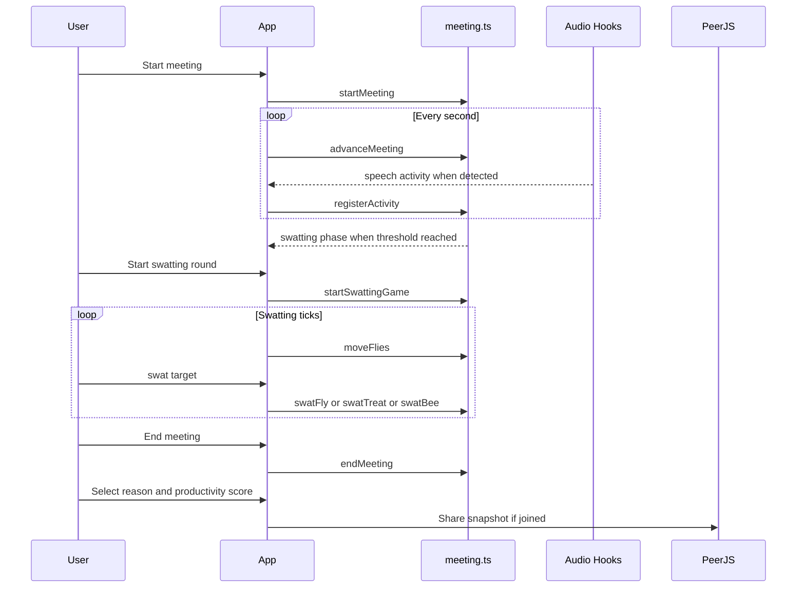

# Application Design

## Design Summary

Boring Meeting Flyswatter is designed as a single-page browser application. The app observes local user silence and inactivity, transitions through a small meeting state machine, launches a short swatting game, and displays a recap that can be shared with peers through WebRTC.

## Design Principles

- Local-first and browser-only.
- No audio recording.
- No free-text PII.
- One boredom trigger per meeting.
- Game intervention must be short and finishable.
- Pure logic should be testable without a browser.
- Browser API failures should degrade gracefully.

## Core Flow

## Data Model

| Model | Purpose |
| --- | --- |
| `MeetingState` | Top-level phase, timing, current game, boredom reasons, and productivity score. |
| `ActiveGame` | Swatting round state, timer, score, targets, and spawn timers. |
| `Fly` | Normal moving target. |
| `Treat` | Score multiplier bonus target. |
| `Bee` | Golden bee bonus target. |
| `ScoreSnapshot` | Peer-shareable score, phase, reasons, and productivity payload. |

## Error Handling

- Microphone errors are shown in the UI and can be dismissed.
- Notification permission denial is ignored without blocking the app.
- Document Picture-in-Picture unsupported browsers show an in-tab fallback.
- PeerJS connection errors move sharing to error state without breaking local meeting flow.
- Local storage failures are ignored to support private browsing and quota failures.

## Privacy Design

The app derives activity signals from local events and local microphone level. It does not persist raw audio, transmit raw audio, or allow free-text boredom explanations. Shared room data is limited to display name, score, phase, selected preset reasons, and productivity score.

## Submission Design Fit

The product balances a memorable creative idea with clear technical boundaries: pure state machine, browser APIs, WebRTC sharing, static deployment, and testable logic.
