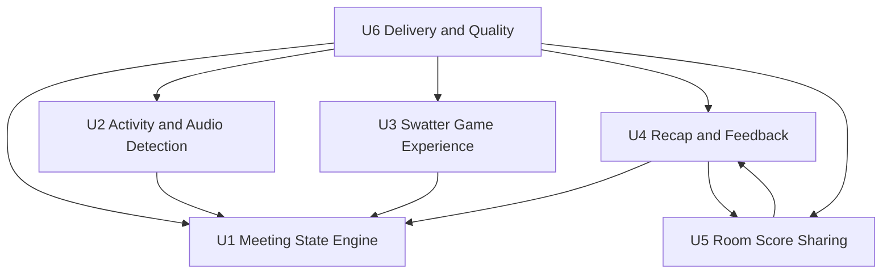

# Unit of Work Dependency Matrix

## Dependency Graph

## Dependency Table

| Unit | Depends On | Reason |
| --- | --- | --- |
| U1 Meeting State Engine | None | Core domain logic. |
| U2 Activity and Audio Detection | U1 | Emits activity that updates meeting state. |
| U3 Swatter Game Experience | U1 | Displays and mutates active game state. |
| U4 Recap and Feedback | U1, U5 | Reads completed meeting state and shared peer snapshots. |
| U5 Room Score Sharing | U4 data model | Shares recap and score snapshots used by recap UI. |
| U6 Delivery and Quality | All units | Validates and documents the entire system. |

## Parallelization Notes

- U1 should be stabilized before changing U2, U3, or U4.
- U2 and U5 can be developed independently because one handles local signals and the other handles peer sharing.
- U3 visual changes can proceed if they preserve U1 reducer contracts.
- U6 runs across all units after changes.
