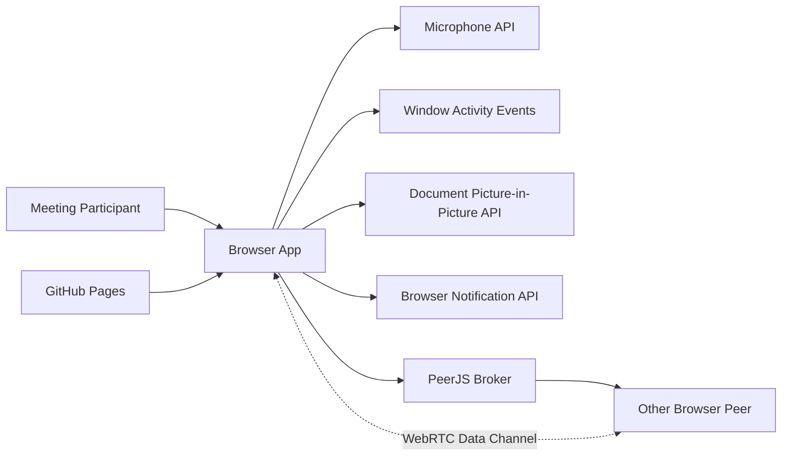
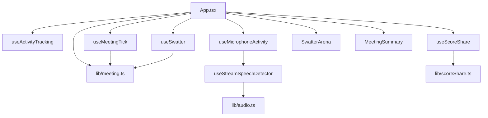
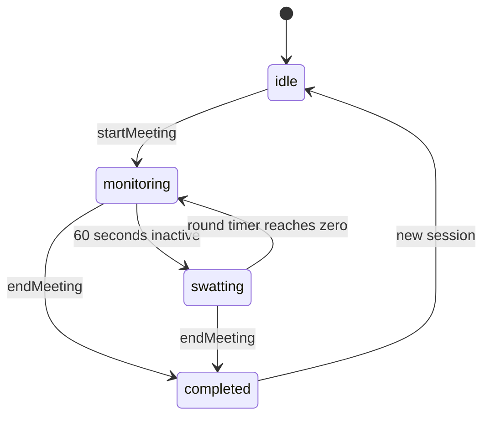

# Architecture

## System Context

## Runtime Architecture

## State Flow

## Key Architectural Decisions

| Decision | Rationale |
| --- | --- |
| Browser-only MVP | Removes account, backend, and deployment overhead for hackathon submission. |
| Pure meeting state functions | Allows core behavior to be tested with Bun without browser rendering. |
| Hooks for browser APIs | Keeps microphone, notification, activity, and WebRTC side effects outside pure logic. |
| PeerJS room sharing | Provides lightweight room discovery without building a signaling server. |
| Preset reason tags | Avoids PII and keeps recap data structured. |
| GitHub Pages | Static deployment matches browser-only architecture. |

## Architecture Risks

- PeerJS public broker introduces dependency on external availability and metadata exposure.
- Browser APIs vary by browser, especially Document Picture-in-Picture.
- Microphone permission denial creates a degraded experience.
- `meeting.ts` is growing and should be split before more mechanics are added.
