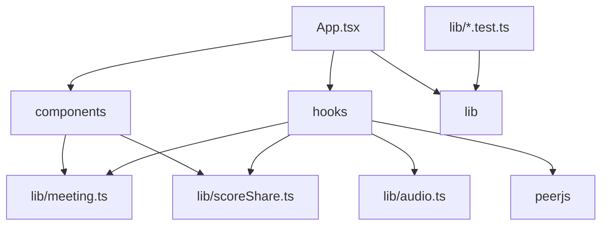

# Dependencies

## Internal Dependency Graph

## External Runtime Dependencies

| Dependency | Purpose |
| --- | --- |
| `react` | UI rendering. |
| `react-dom` | DOM integration. |
| `peerjs` | WebRTC data channel connection management. |

## External Development Dependencies

| Dependency | Purpose |
| --- | --- |
| `vite` | Dev server and production bundling. |
| `typescript` | Type checking. |
| `@vitejs/plugin-react` | React plugin for Vite. |
| `@biomejs/biome` | Linting and formatting. |
| `textlint` and Japanese rules | README language quality. |
| `husky` and `lint-staged` | Local git hooks. |

## Dependency Risks

- PeerJS public broker is a live service dependency for room joining.
- Browser APIs are not uniformly supported across all browsers.
- Vite 8 build currently emits deprecation warnings from the React plugin path.
- CI disables lifecycle scripts, which is good for supply chain security but may affect future dependencies that require install scripts.

## Dependency Boundaries

- Domain tests should not import React.
- Browser hooks should not mutate domain state directly; they report activity or events to `App`.
- PeerJS message validation should remain minimal and structured.
- Static deployment should not require server-side environment variables.
